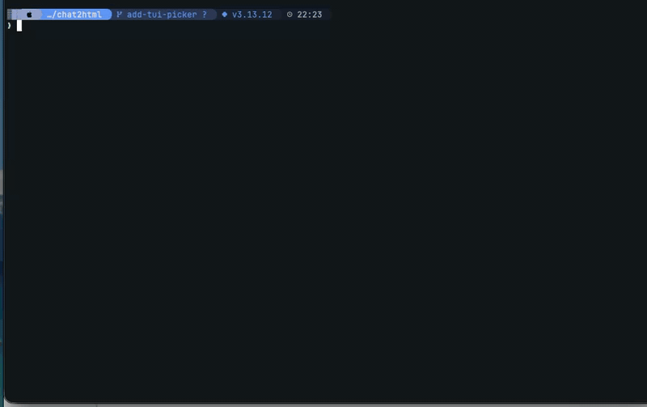

# chat2html

Share-conscious HTML exporter for AI coding-assistant conversations (Claude and Codex).

## Why chat2html?

- **Four formats, one tool** — Auto-detects Claude Code JSONL, claude.ai exports, claude-chat-exporter Markdown, and OpenAI Codex CLI JSONL.
- **Safer sharing defaults** — Tool results are omitted and OAuth URLs (with `state`, `code`, `token`, callback paths) are redacted by default. Use `--full` only when you need the full picture for yourself.
- **Self-contained output** — One HTML file with light/dark themes, syntax highlighting, and collapsible thinking blocks and long pastes.
- **Zero install** — `uvx chat2html session.jsonl`.

## Supported input formats (auto-detected)

1. **claude.ai export** (`conversations.json` / `.jsonl`)
   - Downloadable from Settings → Privacy → Export data (inside the ZIP).
   - Contains multiple conversations — pick them by listing, searching, or index.

2. **Claude Code session** (`~/.claude/projects/<proj>/*.jsonl`)
   - Line-based logs with `type` / `uuid` / `sessionId`.
   - Renders tool-use history (Bash / Read / Edit / Agent, etc.).
   - `thinking` blocks and long `tool_result` outputs are collapsed into `<details>`.

3. **claude-chat-exporter.js Markdown** (`.md`)
   - See <https://github.com/agarwalvishal/claude-chat-exporter>.
   - Uses `## Human (date):` / `## Claude:` headers.

4. **OpenAI Codex CLI session** (`~/.codex/sessions/*.jsonl`)
   - Line-based logs with top-level `{timestamp, type, payload}`.
   - Renders user / assistant text, `function_call` + `function_call_output` pairs (e.g. `exec_command`), and `custom_tool_call` (e.g. `apply_patch`).
   - Encrypted reasoning is omitted; visible `reasoning.summary` is rendered as a `thinking` block.

## Quickstart

Run directly from PyPI with `uv` — no install required:

```sh
uvx chat2html session.jsonl
```

The examples below use `chat2html` as shorthand for the command above.

## Usage

```sh
# Auto-detect format (Claude Code JSONL / Markdown)
chat2html session.jsonl
chat2html conversation.md
chat2html session.jsonl -o out.html

# claude.ai export: list conversations
chat2html conversations.json

# claude.ai export: search by title
chat2html conversations.json -s "API"

# claude.ai export: convert by index
chat2html conversations.json -i 0,3,7 -d out/

# claude.ai export: convert all
chat2html conversations.json --all -d out/

# Batch multiple files (Markdown / Claude Code JSONL)
chat2html a.md b.jsonl -d out/

# Directory: pick logs interactively from a TUI list
chat2html ~/.claude/projects/myproj -d out/

# Directory: convert everything underneath without the picker
chat2html ~/.codex/sessions/2026/04 --all -d out/
```

### Directory mode (TUI picker)



Pass a directory and chat2html will walk it for `.md` / `.jsonl` files,
drop anything that isn't a supported chat log, and show a multi-select
list (↑↓ to move, Space / `x` to toggle, Enter to confirm, Esc / `q` to quit).
Entries are sorted newest-first by mtime, with a one-line preview of
the first user message (housekeeping slash-commands like `/clear` are
skipped so they don't become the preview text). Combine with `--all` to
skip the picker and convert every log under the directory.

Two safety caps keep the picker manageable when pointed at a deep tree
like `~/.claude` or `~/.codex`:

- `--depth N` — max recursion depth from the given root
  (`0` = root only, default `5`).
- `--max-files N` — cap the list at the N most-recent files
  (`0` = no cap, default `200`). When entries are dropped, a notice is
  printed to stderr.

## Options

| Option | Description |
| --- | --- |
| `-o`, `--output` | Output file path (single conversation only). |
| `-d`, `--outdir` | Output directory. |
| `-s`, `--search` | Search conversations by title (claude.ai export). |
| `-i`, `--index` | Comma-separated indices to convert (claude.ai export, e.g. `0,2,5`). |
| `--all` | Convert all conversations (claude.ai export) or every log under a directory (directory mode). |
| `--depth N` | Directory mode: max recursion depth from the given root (`0` = root only, default: `5`). |
| `--max-files N` | Directory mode: cap the picker list at the N most-recent files (`0` = no cap, default: `200`). |
| `--lang {ja,en}` | Output language (default: `ja`). |
| `--full` | Show full tool input/output. By default, `tool_result` is omitted and `tool_use` only shows description-like fields for safer sharing. OAuth-related URLs are always masked, even with `--full`. |

## ⚠️ What chat2html does NOT protect against

chat2html redacts OAuth URLs and omits tool results by default, but it is **not a general-purpose secret scrubber**. Before sharing any output, you should still review it for:

- API keys and tokens (e.g., `sk-ant-...`, `ghp_...`) that may appear in tool inputs or assistant text
- Personal file paths (`/Users/yourname/...`, `C:\Users\...`)
- Internal hostnames, repository names, or IP addresses
- PII in pasted content (emails, phone numbers, etc.)
- Long pastes are collapsed into `<details>` but **still present in the HTML source** — they're hidden visually, not removed.

If you need stronger guarantees, consider running a secret scanner (e.g., `gitleaks`, `trufflehog`) on the output before sharing.

### Extra safety: scan the output before sharing

chat2html does not detect arbitrary secrets like API keys or tokens embedded in conversation content. If you're sharing with a wide audience, pipe the output through a dedicated secret scanner:

- **[gitleaks](https://github.com/gitleaks/gitleaks)** — `gitleaks dir out.html -v`
- **[trufflehog](https://github.com/trufflesecurity/trufflehog)** — `trufflehog filesystem out.html`

Both are open-source CLIs available via Homebrew and most package managers.

## Development

```sh
uv sync --all-groups        # install runtime + dev dependencies
uv run pytest               # run the test suite
uv run ruff check .         # lint
uv run ruff format .        # auto-format
uv run pre-commit install   # install the git hook (one-time per clone)
```

`pre-commit` runs `ruff` (lint + format) and a few hygiene checks
(trailing whitespace, EOF newline, TOML/YAML syntax, large-file guard)
on every commit; see `.pre-commit-config.yaml`. CI runs the same
`ruff check` + `pytest` on every push and PR
(see `.github/workflows/ci.yml`).
